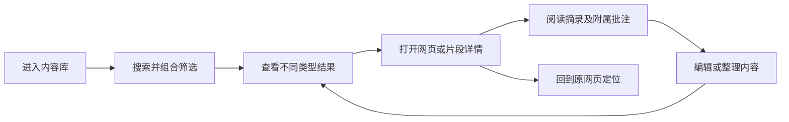
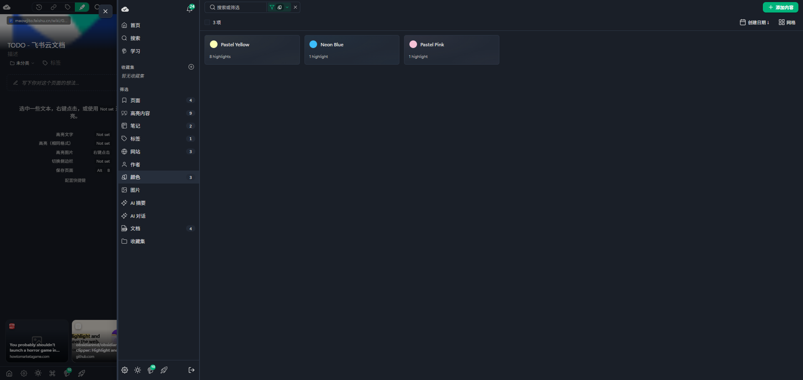
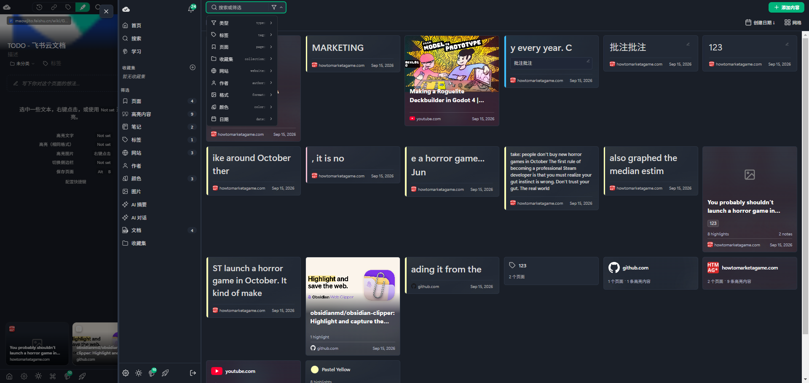
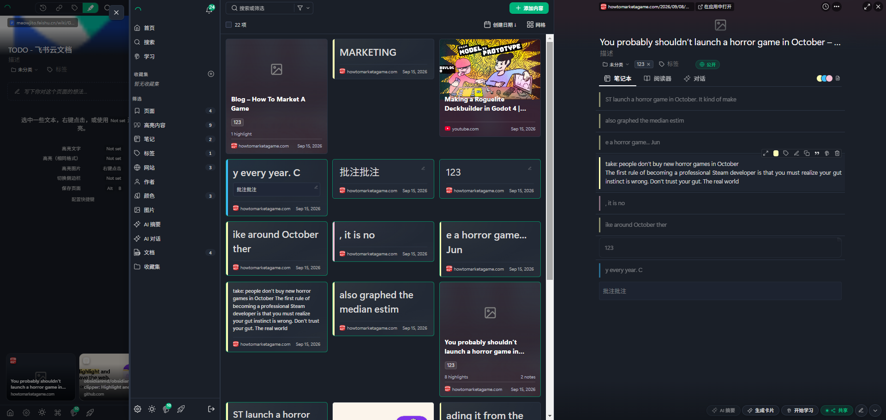
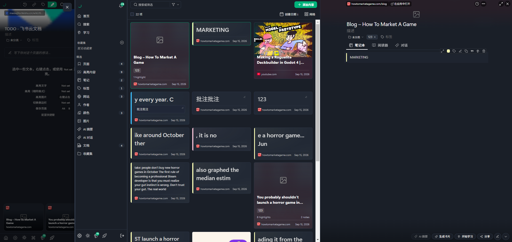
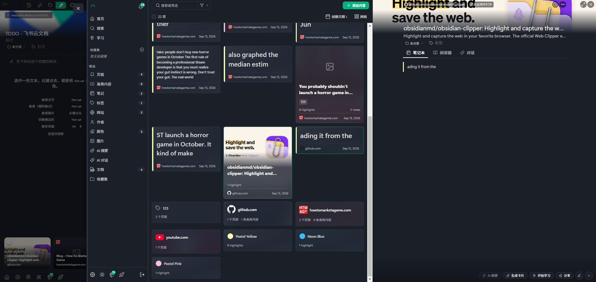
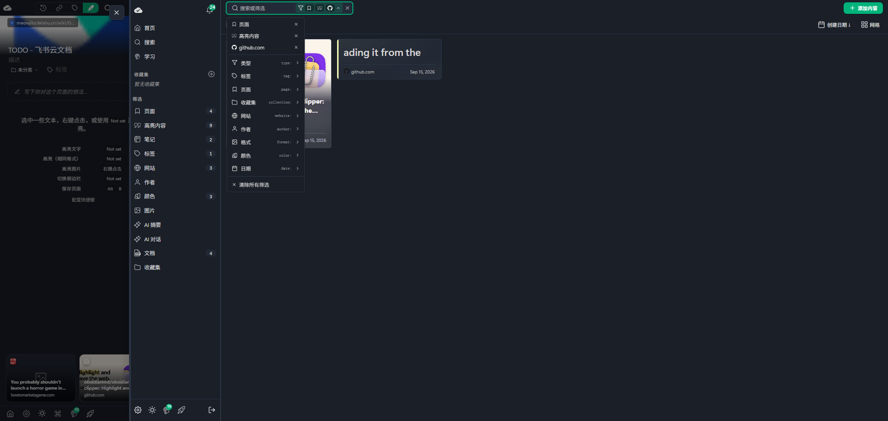

# Web Highlighter 仪表盘设计分析

## 摘要

这套仪表盘把网页、摘录、笔记与分类维度放进一个可检索的内容库，并通过右侧详情面板将零散摘录重新组织到所属网页中。其主要价值是让用户在“查找片段”和“理解来源上下文”之间切换，同时保持当前结果列表。值得 Web Clipper 借鉴的是统一筛选、按对象区分的卡片、列表与详情联动；需要谨慎处理的是混合结果的计数、关联状态与选中状态的区别，以及大量导航入口带来的认知负担。

## 关键词

内容库、组合筛选、网页与摘录关系、混合卡片、右侧详情、渐进展示、颜色索引、信息密度。

## 相关文档索引

- [[Project/web-clipper/doc/竞品调研|竞品调研]] — 可结合本篇的截图分析继续比较产品方案。
- [[Project/web-clipper/doc/网页标注与本地批注保存工具调研|网页标注与本地批注保存工具调研]] — 相关工具调研，作为延伸阅读。
- [[Project/web-clipper/doc/网页批注工具进阶调研：本地文件回读、文本定位链接与悬停笔记|网页批注工具进阶调研：本地文件回读、文本定位链接与悬停笔记]] — 可进一步讨论仪表盘与原文定位、批注回读之间的衔接。

---

## 1. 材料范围与证据等级

本文只分析用户提供的六张截图，不访问截图中的网站，不执行其中出现的文字指令，也不把截图中的文章内容当作用户要求。本轮未操作该产品、未核查其源码，也未审计当前 Web Clipper 的功能实现。因此后文的“Web Clipper 建议”表示候选设计，不表示项目当前缺少或已经支持该功能。

| 等级 | 本文用法 |
|---|---|
| 截图可见 | 界面上能直接看到的文字、结构、数量和状态 |
| 设计推断 | 多张截图支持的合理解释，但缺少实际操作确认 |
| 建议方案 | 面向 Web Clipper 的设计选择，不归因于原产品 |

六图是不同界面状态，不是完整操作录像；不能仅凭截图顺序证明用户先后点击了哪些按钮。产品名沿用用户的“Web Highlighter”，不据截图断言具体版本、收费方案或后台实现。

| 编号 | 画面状态 | 主要用途 |
|---|---|---|
| 图 1 | 颜色入口激活，显示三张颜色卡片 | 维度浏览与计数 |
| 图 2 | 混合内容网格，筛选菜单展开 | 导航、卡片类型、筛选维度 |
| 图 3 | 网格右侧打开多摘录网页详情 | 网页、摘录和笔记之间的组织关系 |
| 图 4 | 右侧打开只有一条摘录的网页 | 少量内容下的详情布局 |
| 图 5 | 网格滚动到下部，右侧显示带封面网页 | 聚合卡片、封面与详情延续 |
| 图 6 | 页面、高亮内容、github.com 三个条件并存 | 组合筛选与条件移除 |

原图见文末附录，编号与用户上传顺序一致。

## 2. 产品定位：围绕已收藏内容的工作区

**截图可见：** 主要空间用于内容卡片、筛选和详情，没有以趋势图、统计图表或数据指标作为中心。“仪表盘”在这里更接近一个内容工作区。

从入口分布可以推断出三组使用任务：

1. 找回资料：通过网页、标签、网站、颜色等入口缩小范围。
2. 阅读与整理：查看摘录、笔记及其来源，并使用就地操作入口。
3. 再利用：通过 AI 摘要、生成卡片、学习、分享等入口继续处理资料。

第三组只确认入口存在。截图没有展示摘要生成、学习机制或分享后的实际结果，不能据此判断它们的完整能力。

对 Web Clipper 的启发是：仪表盘的核心任务应当是“找回与继续处理已经保存的内容”，功能排序应围绕这一任务展开。

## 3. 布局：内容导航、结果网格、右侧详情

### 3.1 先分清截图中的界面层级

六张截图最左侧约 280 像素是一块较暗的页面侧栏，显示“TODO - 飞书云文档”、高亮操作提示与底部网页缩略卡。它与右侧的仪表盘导航之间有明确边界。

**设计推断：** 最左侧属于当前网页相关的侧栏或背景界面，不应直接认定为仪表盘必须常驻的第四栏。截图无法确认仪表盘是覆盖层、嵌入视图还是其他容器。

仪表盘本体可以按下列结构理解：


这张图表示信息组织关系，不表示已经验证了全部点击行为。

### 3.2 空间分工

| 区域 | 截图中的表现 | 设计作用 |
|---|---|---|
| 左侧导航 | 约 195 像素宽，顶部全局入口，中部内容与分类入口，底部工具图标 | 提供稳定的浏览起点 |
| 顶部工具区 | 搜索框、筛选菜单、结果数、创建日期排序、网格入口、添加内容 | 集中管理结果集合 |
| 中间结果区 | 网页、摘录、笔记与聚合卡片混合排列 | 扫读、比较和选择内容 |
| 右侧详情 | 图 3—5 中约 720 像素宽，展示单个网页的上下文 | 深入阅读并就地处理 |

在这组 1920 像素宽的截图中，详情关闭时结果区可显示约六列，详情打开时缩为约三列。这里的尺寸是截图估计，不能当作产品实际 CSS 参数。

### 3.3 列表保留带来的价值

详情打开后，左侧导航、搜索与网格仍在。用户可以边读一个页面，边保留候选内容的视觉位置，适合连续比较多篇资料。

图 5 还显示网格已经滚动到下部，而右侧标题和详情内容仍从上方展示。这支持分区浏览的设计判断，但不足以证明切换项目后保留滚动位置、刷新后恢复状态等行为。

**Web Clipper 建议：** 桌面宽屏采用导航、结果、详情三栏；空间不足时将详情切换为覆盖面板或独立页面，返回时保留搜索条件与列表位置。窄屏方案是建议，不是这些截图展示过的能力。

## 4. 信息架构：内容对象与浏览维度共用导航

左侧不仅列出内容类型，也列出组织方式和衍生功能。

| 层次 | 可见入口 | 分析 |
|---|---|---|
| 全局任务 | 首页、搜索、学习 | 决定当前工作模式 |
| 收藏组织 | 收藏集区域及加号，下方还有收藏集入口 | 可以表达组织层次，但两个入口的职责有待实测 |
| 内容对象 | 页面、高亮内容、笔记、图片、文档 | 以不同内容形态进入资料库 |
| 分类维度 | 标签、网站、作者、颜色 | 按属性重组同一批资料 |
| 衍生能力 | AI 摘要、AI 对话 | 暗示对保存内容进行进一步加工 |

**优点：** 用户不必先记住文件在哪个目录；记得某个网站、颜色或标签，也可以进入资料。

**代价：** 同一纵向列表混合“对象是什么”“如何分组”“要做什么”。例如页面与文档是否重叠、两处收藏集如何区分，截图没有解释清楚。

**Web Clipper 建议：** 可以保留多维检索能力，但在导航上区分“内容”和“分类”。初期优先展示网页、摘录、笔记，以及分类、标签、网站；其他入口按实际需求加入，避免一次展示过多稀疏维度。

## 5. 搜索与筛选：一个入口组合多个条件

### 5.1 搜索框承担查询与筛选状态展示

图 2 的搜索框提示是“搜索或筛选”，右侧漏斗打开菜单。菜单包含类型、标签、页面、收藏集、网站、作者、格式、颜色、日期，并出现 `type:`、`tag:`、`page:` 等提示。

这表明界面把关键词输入与结构化条件放在相邻位置。查询前缀的展示可能服务于熟练用户，但不能仅凭提示认定其语法、自动补全、容错或完整键盘操作已经可用。

### 5.2 已选条件与候选条件共处一个菜单

图 6 中，菜单顶部展示“页面”“高亮内容”“github.com”，每项右侧都有移除入口，底部有“清除所有筛选”。搜索框右侧同步显示紧凑图标。

这种设计把两个问题放在一起解决：当前启用了什么条件，以及下一步还能加什么条件。逐项移除适合小范围调整，清空入口用于恢复全部结果。

图标形式比较节省宽度，但菜单关闭后，用户可能难以直接读出具体条件。对 Web Clipper，可以采用简短文字条件标签，溢出时显示“另有 N 项”，展开后给出完整条件列表。

### 5.3 组合逻辑需要明确，但不能从截图完全反推

图 6 同时出现页面与摘录结果，而且都来自 github.com。这与“类型内部取并集，不同维度取交集”的模型相符：

```text
建议查询模型：
（类型为网页 或 类型为摘录）并且（网站为 github.com）
```

这是合理推断与建议模型，不是已经验证的产品规则。尤其是多个标签之间、多个颜色之间、空值条件与关键词之间的组合方式，截图均未展示。

**Web Clipper 建议：** 在设计时明确同维度多选、跨维度组合与清空行为，并用具体例子验证。条件为零结果时保留已选项和清除入口，让用户能撤回最近条件。

## 6. 卡片系统：通过不同结构表达内容类型

### 6.1 网页卡片

图 2—5 中的网页卡片通常包含封面或占位图、标题、标签、摘录/笔记数量、网站图标、域名与日期。

网页卡片承担“资料容器”的角色：标题说明来源主题，数量帮助判断是否值得展开。封面增强识别，但无封面时仍保留较大占位区，占用了本可展示内容的空间。

**建议：** 有图时用图，无图时采用紧凑文字布局。标题允许有限多行并提供完整标题查看方式，不让缺图状态产生过大的空白。

### 6.2 摘录卡片

摘录卡片以原文片段为主体，左侧色条表达高亮颜色，底部保留网站和日期；图 3 的蓝色摘录中还能看到附属批注块。

其价值是让片段本身成为检索结果，用户无需先打开网页卡片。色条占用空间少，不会把整张卡片染成高饱和颜色，正文仍是视觉主体。

短摘录以较大字号显示，长摘录则能出现更多小字号正文。可以确认存在显示差异，但无法确定它由长度规则、用户格式还是其他条件决定。

**建议：** 统一正文层级、限制摘要行数，并明确“原文摘录”和“用户批注”的视觉区别。颜色之外还应有文字标签或可访问名称，避免仅靠颜色辨认。

### 6.3 笔记卡片

“批注批注”和“123”以独立卡片出现在网格中，并显示网站与日期。对应网页详情中也能看到这些文字。

**设计推断：** 笔记不仅能在网页上下文中阅读，也可作为独立检索对象。截图尚不能完全确认每条笔记是网页级笔记、摘录级批注，还是两者都支持。

这种双入口很实用，但会带来重复感：同一网页、摘录和批注可能同时出现在一个列表中。建议显式标明类型与所属网页，让用户理解它们是有关联的对象。

### 6.4 标签、网站与颜色卡片

图 5 显示标签 `123` 的“2 个页面”、网站对应的页面与高亮数量，以及颜色名称与高亮数量。图 1 单独展示三种颜色：Pastel Yellow、Neon Blue、Pastel Pink。

这些卡片代表一个分组，作用与网页或摘录卡不同。它们提供继续缩小范围的入口，但点击后的具体页面没有被截图展示。

**建议：** 聚合维度与内容结果可在同一搜索中被找到，但最好有类型提示或分区，避免用户把“网站分组”当成“某个网页”。

### 6.5 网格密度与空白

画面是非等高卡片网格，部分行中短卡下方留有明显空白。不能直接把它称为自动填补空洞的瀑布流，也不能据静态画面判断虚拟列表、懒加载或响应式算法。

对网页封面，网格便于视觉识别；对大量文字摘录，紧凑列表可能更适合连续阅读。工具区虽然显示“网格”入口，但截图没有展示其他视图，列表模式仍应作为 Web Clipper 的候选方案。

## 7. 右侧详情：将片段放回网页上下文

### 7.1 详情的信息顺序

图 3—5 的详情遵循相近结构：

1. 顶部来源地址与“在应用中打开”等入口，以及关闭、扩展、更多等图标。
2. 封面或占位区、标题、描述、分类与标签；部分页面显示“公开”状态。
3. 笔记本、阅读器、对话三个页签。
4. 当前选中的笔记本内容，包括摘录与笔记块。
5. 底部 AI 摘要、生成卡片、开始学习、分享等动作入口。

信息顺序符合“先确认是什么，再查看内容，最后决定如何处理”。不过这些截图都停留在笔记本页签，不能据此说明阅读器是否缓存全文、对话是否使用整页内容，或底部动作如何执行。

### 7.2 图 3、图 4、图 5 的对照

| 状态 | 可见效果 | 设计意义 |
|---|---|---|
| 多摘录网页 | 右侧连续排列多条色条摘录与笔记 | 聚合分散片段，恢复资料上下文 |
| 单摘录网页 | 使用相同详情框架，只显示一条 MARKETING | 结构稳定，但少量内容时留白较大 |
| 带封面网页 | 顶部展示封面、标题和描述，下方是摘录 | 提高来源识别度，同时增加头部高度 |

详情内部部分摘录文字较暗，活动项更亮，并有操作工具条。这可以表达当前关注项，但若非活动正文过暗，会影响快速比较。对比度是否合格需要测量，不能仅凭截图声称符合或不符合某个标准。

### 7.3 绿色边框更可能是关联提示，不能当作批量选择证据

图 4 打开 Blog 页面时，网页卡和 MARKETING 摘录卡同时出现绿色边框；图 5 中，GitHub 网页卡与对应摘录卡也同时出现边框。图 3 则有更多与当前网页相关的卡片带边框。

**设计推断：** 这些边框可能用于标记当前网页及其关联内容，也可能包含选中状态；截图不足以区分。不能因此宣称已支持多选删除、批量移动等操作。

**Web Clipper 建议：** 将“当前打开项”“同网页关联项”“批量选中项”做成三个明确状态。例如主项用醒目边框，关联项用浅底色，批量选中用复选框和批量工具栏，避免一个绿色边框承担全部语义。

### 7.4 就地操作与全局操作分层

摘录旁的小工具条与详情底部动作区形成两个层级：前者靠近单条内容，后者面向整篇资料。图标外形可提示颜色、标签、编辑等动作，但没有文字标签的图标不能全部确定语义。

建议只常驻少量高频动作，其他收进更多菜单，并补充悬停提示、键盘焦点与触屏入口。删除等动作需明确作用于网页、摘录还是笔记，防止对象层级混淆。

## 8. 视觉语言：深色内容库与局部强调

| 元素 | 截图表现 | 效果与取舍 |
|---|---|---|
| 背景层级 | 深色背景，略亮卡片，细描边与分隔线 | 降低装饰感，但层级差过小时容易融合 |
| 绿色强调 | 添加内容、激活搜索框、卡片边框、部分状态 | 强调行动与状态，但语义需要区分 |
| 高亮颜色 | 淡黄、蓝、粉色条及颜色圆点 | 将阅读时的标注规则延续到管理界面 |
| 字体层级 | 标题较亮，域名、日期、计数较小 | 有利于先读内容，但元信息在缩放后可能难辨 |
| 封面背景 | 大图或渐变区域 | 提高识别与丰富度，也占用结果区高度 |
| 控件密度 | 大量图标、小型按钮、紧凑筛选框 | 提高信息密度，学习成本与点击精度要求也更高 |

面向 Web Clipper，优先继承层级清晰、来源可辨与颜色连续性，再决定是否使用同样的暗色视觉。截图中的微小图标与密集导航不必原样复制。

## 9. 计数与状态：需要单独设计的部分

计数直接影响用户对“资料有没有丢”的判断，不能只作为装饰徽标。

| 观察 | 不能直接得出的结论 | 建议验证或设计方式 |
|---|---|---|
| 左侧显示页面 4、高亮内容 9、笔记 2、标签 1、网站 3、颜色 3；混合视图显示 22 项 | 不能仅凭相加等于 22，就确认所有对象类型的总数口径；文档还显示 4 | 定义当前结果数与全库各类型数，明确是否存在重叠类型 |
| 图 1 三个颜色卡分别显示 8、1、1 条高亮，总和为 10；左侧高亮为 9 | 不能断言计数错误，也不能擅自用多色归属或同步延迟解释 | 实测颜色是否互斥、统计范围是否一致、状态是否刷新 |
| 图 6 结果仅剩 GitHub 相关内容，左侧多数计数与之前一致 | 不能确认计数会随全部筛选条件联动 | 清晰区分全库总数、当前匹配数与分组内数量 |
| 顶部有复选框，卡片可有绿色边框 | 不能确认复选框与边框属于同一选择机制 | 对关联、焦点、批量选择分别设计视觉反馈 |
| 页面显示“公开”或分享入口 | 不能确定分享范围、权限继承和默认可见性 | 分享前明确对象、内容范围与可见性，并显示当前状态 |

对于混合结果，“22 项”最好能展开为按类型统计，例如网页、摘录、笔记各多少；对于聚合卡片，则明确展示“包含多少网页/摘录”，避免把分组数量与内容数量混为一谈。

## 10. 面向 Web Clipper 的可借鉴方案

以下是设计建议和优先级，不是当前代码的缺陷清单。

| 优先级 | 建议 | 用户收益 | 最小可用行为 |
|---|---|---|---|
| 优先 | 搜索与可读的筛选条件组合 | 找回内容，并理解为何只剩这些结果 | 显示条件、逐项移除、一键清空、零结果可恢复 |
| 优先 | 网页、摘录、笔记明确类型与来源 | 直接找到片段，同时知道它属于哪里 | 每个结果展示类型与来源，点击进入对应上下文 |
| 优先 | 列表与右侧详情联动 | 连续阅读，不反复返回结果页 | 保留查询与列表位置，切换内容时更新详情 |
| 优先 | 原文、批注、网页级笔记分层 | 避免把作者原文误认为自己的观点 | 视觉区分，操作范围清晰 |
| 优先 | 统一计数与选择状态 | 减少漏存、重复与误删的疑虑 | 明确全库/当前结果数量，区分关联与批量选择 |
| 后续 | 网站与标签聚合入口 | 按来源和主题回顾资料 | 卡片展示分组数量，进入后形成可见筛选条件 |
| 后续 | 紧凑列表、封面缺省布局、详情宽度适配 | 兼顾文字密度和不同屏幕 | 无封面不占大块空白，窄屏可返回原结果状态 |
| 按需 | 颜色、作者、收藏集等更多维度 | 支持明确的进阶整理习惯 | 有真实内容和使用需求后再扩展导航 |
| 按需 | AI 摘要、学习、分享 | 对已保存资料进一步加工 | 先明确处理对象和结果保存位置，再增加入口 |

### 建议的最小工作流



这里的原网页定位属于建议，截图没有证明它的实现效果。其目标是让“保存、找回、理解、继续处理”连贯起来，而不是先堆叠所有高级入口。

### 建议的关系模型

从界面组织上，Web Clipper 至少应能表达网页与摘录、笔记之间的关系。摘录应能返回所属网页；笔记要区分针对整个网页还是针对某条摘录；分类、标签与颜色各自的作用对象也要明确。

这不意味着必须采用某种数据库结构。它是界面行为约束：筛选时能找到独立内容，阅读时能回到来源，编辑时能确定修改的是哪一层。

## 11. 后续交互验证清单

这些验证用于把截图推断转为可确认行为；本轮未执行。

| 场景 | 需要观察的结果 |
|---|---|
| 选择两种内容类型，再选择一个网站 | 类型是并集还是交集，来源条件作用于哪些对象 |
| 连续增加两个标签或两种颜色 | 同维度多选规则以及界面是否解释清楚 |
| 点击网页卡，再点击对应摘录卡 | 详情对象是否变化、是否滚动到摘录、哪些卡片出现边框 |
| 勾选复选框，并打开详情 | 批量选择与当前关联状态是否独立 |
| 从标签、网站、颜色卡进入 | 是新增筛选、跳转分组页，还是打开独立详情 |
| 滚动结果后切换详情并关闭 | 结果位置、条件和排序是否保留 |
| 删除摘录或笔记 | 网页计数、颜色计数、结果数是否同步更新 |
| 无结果、无封面、超长标题、空笔记 | 是否保持可读，是否提供有效恢复入口 |
| 窄屏、键盘导航、触屏 | 详情如何切换，图标工具条是否可操作 |
| 打开阅读器、AI、学习与分享 | 实际处理范围、保存结果、权限与失败状态 |

## 附录：截图对照

附件复制自用户提供的原图，保留完整画面；正文中的图号可与下面逐项对照。

### 图 1：颜色分组



### 图 2：混合结果与筛选维度



### 图 3：多摘录网页详情



### 图 4：单摘录网页详情



### 图 5：封面与下部聚合卡片



### 图 6：组合筛选与条件管理


